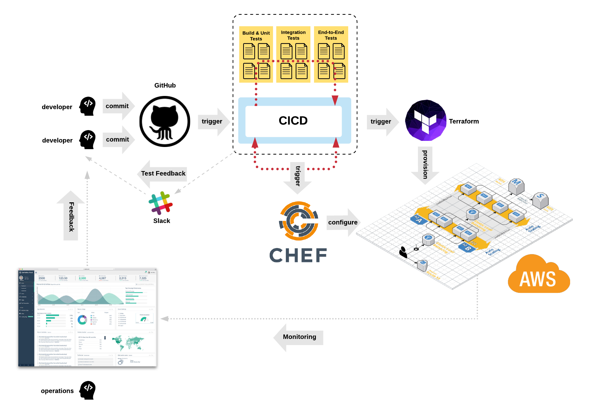

### Content Lead Architect
- Jeremy leads the DevOps team here at [Cloud Academy](https://cloudacademy.com/).
- Jeremy holds professional certifications for **AWS**, **GCP**, **Terraform**, and **Kubernetes** (CKA, CKAD, CKS).
- Software Engineering - language fluency:
  - Java
  - C#
  - Go
  - Python
  - React
  - Swift

Jeremy has a strong background in software engineering, he has been coding with various languages, frameworks, and systems for the past 25+ years. In recent times, Jeremy has been focused on DevOps, Cloud, Security, Kubernetes, and Machine Learning.

https://www.linkedin.com/in/jeremycook123/

